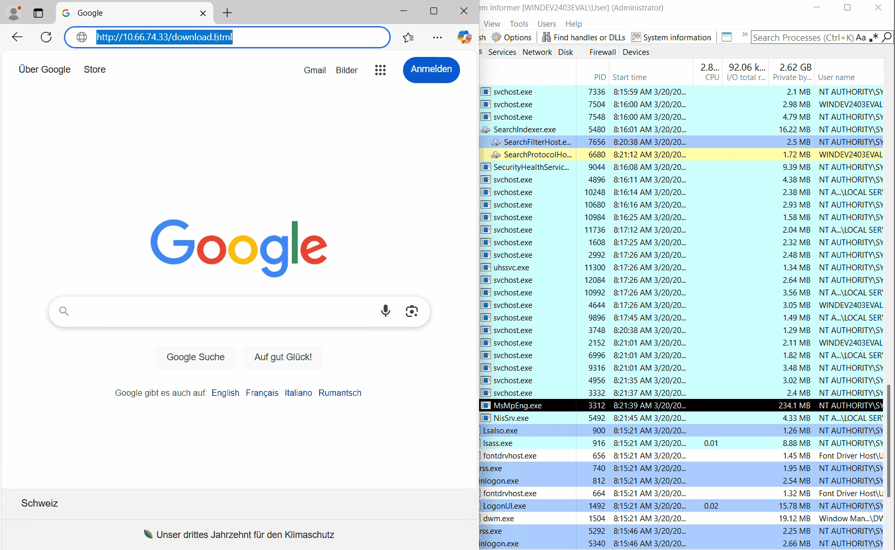
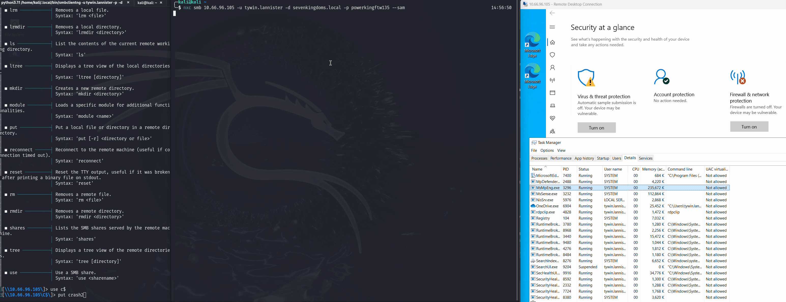

# Defender MpEngine Fuzzing and Unpatched DoS POCs

This repository contains fuzzing harnesses for [kAFL](https://github.com/IntelLabs/kAFL) and [Jackalope](https://github.com/googleprojectzero/Jackalope) and results in `crashes` for Microsoft Defender's local scanning and emulation engine `mpengine.dll` (Microsoft Malware Portection Engine). The code is based on [mpclient.c](https://github.com/taviso/loadlibrary/blob/master/mpclient.c).

For a detailed write-up of the research, fuzzing methodology, and bug analysis, please refer to the accompanying blog post: **[Attacking EDRs Part 4: Fuzzing Defender's Scanning and Emulation Engine (mpengine.dll)](https://labs.infoguard.ch/posts/attacking_edr_part4_fuzzing_defender_scanning_and_emulation_engine/)**

Microsoft does not plan to address the identified bugs immediately:
> After careful investigation, this case has been assessed as moderate severity and does not meet MSRC’s bar for immediate servicing. 

As of May 2025, most of the bugs to crash Defender (`MsMpEng.exe`) are unpatched and can be abused to execute otherwise blocked malicious actions. Some of them do not crash without PageHeap. Details are described on the [IG-Labs Blog](https://labs.infoguard.ch/posts/attacking_edr_part4_fuzzing_defender_scanning_and_emulation_engine/#results)

**Update:** Shortly after this repository was published, all bugs were fixed silently.

> [!CAUTION]
> The fuzzing was seeded with real Malware from VX-Underground. Therefore, the files in `Crashes` will contain parts of it and you should be careful.

To test the harness without a fuzzer, `mpclient_defender_harness_withoutHypercalls.c` can be used to load the `mpengine.dll` and scan a file using `RSIG_SCAN_STREAMBUFFER`. Enable PageHeap for the binary before executing to catch the bugs. Crash1 does not trigger with this harness. Crash2 crashes defender in normal conditions without PageHeap.

## Example POCs
Crash Defender by clicking a link that triggers a "PDF" download. This could be used in combination with a initial access payload:

Crash defender by uploading a file via SMB before dumping credentials:

